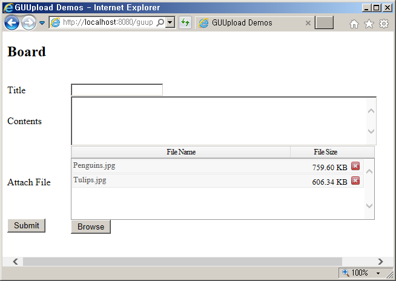
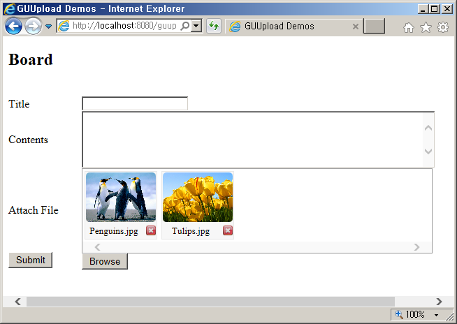

gu-upload is a JavaScript Library that wraps the HTML5(AJAX) upload function. 

It brings your uploads to the next level with Multiple File Selection, Upload Progress and Drag & Drop.

Especially, it support all web browsers.

In version of Internet Explorer 9 or less, SWFUpload is used.

and other version( over IE 10) and web browser used gu-upload.

It has been tested in Internet Explorer and Firefox (Chrome).

Features

    Drag & Drop File
    Multiple File Selection
    File Upload Progress
    List & Thumbnail mode

Examples 

There is a web project with some simple examples of using guupload with Java(Spring 4).

You can get download through other [github](https://github.com/gujc71/guupload_sample "guupload sample") page.

### License ###
MIT
